# 🛡️ Virtual Enterprise SOC & Threat Detection Lab

A self-built home lab simulating a small enterprise network with a firewall, SIEM stack, and endpoint monitoring — designed to practice real-world SOC workflows: log correlation, threat detection, alerting, and controlled offensive-security testing.

> This is a documentation-style repository. There's no application code here — it's a written record of the lab's architecture, configuration, and findings, along with supporting screenshots.

---

## 🧩 Lab Architecture

```
                        ┌─────────────────────┐
                        │   pfSense Firewall   │
                        │  (WAN/LAN, NAT, IDS) │
                        └──────────┬───────────┘
                                   │
                 ┌─────────────────┴─────────────────┐
                 │                                     │
        ┌────────▼────────┐                  ┌─────────▼────────┐
        │  Ubuntu (Target) │                  │  Kali Linux       │
        │  + Wazuh Agent   │                  │  (Attacker Box)   │
        └────────┬─────────┘                  └───────────────────┘
                 │
        ┌────────▼─────────┐        ┌──────────────────────┐
        │  Wazuh Manager    │◄──────►│  Splunk (SIEM)        │
        │ (log/FIM alerts)  │  logs  │  dashboards + alerts  │
        └───────────────────┘        └──────────────────────┘
```

All virtual machines run behind the pfSense firewall, which acts as the network's gateway and first line of defense.

## 🛠️ Tools & Technologies

| Category | Tools |
|---|---|
| Firewall / Network Security | pfSense, pfBlockerNG (DNSBL) |
| SIEM | Splunk |
| Endpoint Detection & Monitoring | Wazuh (agent + manager, FIM) |
| Offensive Security / Pentesting | Kali Linux, Metasploit Framework, Nmap, Netdiscover |
| Target / Vulnerable Systems | Metasploitable2 |
| Traffic Analysis | Wireshark |
| Virtualization | VirtualBox |

## 📋 What Was Built

### 1. Network Design & pfSense Firewall
Configured pfSense as the gateway for the whole lab: WAN/LAN interfaces, NAT, DHCP/DNS, and custom firewall rules to control traffic between Ubuntu and Kali Linux VMs.

### 2. Wazuh Endpoint Monitoring
Deployed Wazuh agents on Ubuntu and Kali Linux, connected to a centralized Wazuh manager for real-time log collection, file integrity monitoring (FIM), and detection of suspicious behavior (e.g. brute-force attempts, unauthorized file changes).

### 3. Splunk SIEM Integration
Installed Splunk and forwarded pfSense firewall logs via syslog. Built dashboards to visualize blocked traffic, login attempts, and port-scan activity, and configured alerts to trigger on suspicious patterns.

### 4. URL Filtering with pfBlockerNG / DNSBL
Added pfBlockerNG to pfSense and configured DNSBL blocklists (e.g. EasyList) to block malicious/unwanted domains at the DNS level, verifying enforcement with a blocked-page test.

### 5. Vulnerability Assessment & Penetration Testing
Used Kali Linux against Metasploitable2 to practice the full pentest lifecycle:
- **Recon:** Nmap full port scans + Netdiscover for host discovery
- **vsftpd 2.3.4 backdoor (port 21):** identified via version fingerprinting, exploited via Metasploit for shell access
- **Samba `usermap_script` RCE:** exploited via `exploit/multi/samba/usermap_script`
- **PostgreSQL exploit:** obtained a Meterpreter session for post-exploitation practice
- **Telnet cleartext traffic:** captured and analyzed credentials in Wireshark to demonstrate the risk of unencrypted protocols

### 6. Network Traffic Monitoring
Used Wireshark and pfSense's packet capture to inspect traffic between VMs and identify anomalies such as port scans.

## 🎯 Key Takeaways

- Hands-on understanding of how SIEM platforms (Splunk) and EDR/host-based tools (Wazuh) complement each other in a layered defense
- Practical grasp of firewall rule design, NAT, and DNS-based content filtering with pfSense/pfBlockerNG
- End-to-end pentest experience: recon → vulnerability identification → exploitation → post-exploitation
- Reinforced how centralized log correlation is essential for fast incident detection in a SOC context

## Lab Architecture & Implementation Gallery

### 1. Network & Firewall Configuration (pfSense)

* **RFC 1918 Alias Configuration**  
  Centralized alias configuration on pfSense defining private IPv4 address blocks (RFC 1918).
  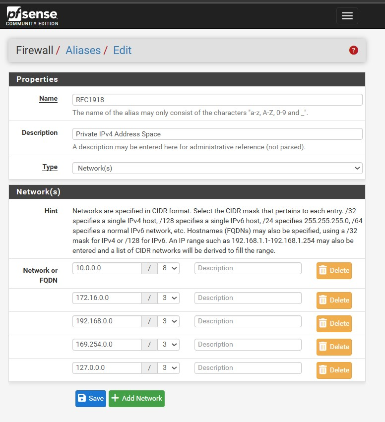

* **Security Interface Rules**  
  Firewall rule definition governing outbound traffic for the SECURITY interface to local subnets and the internet.
  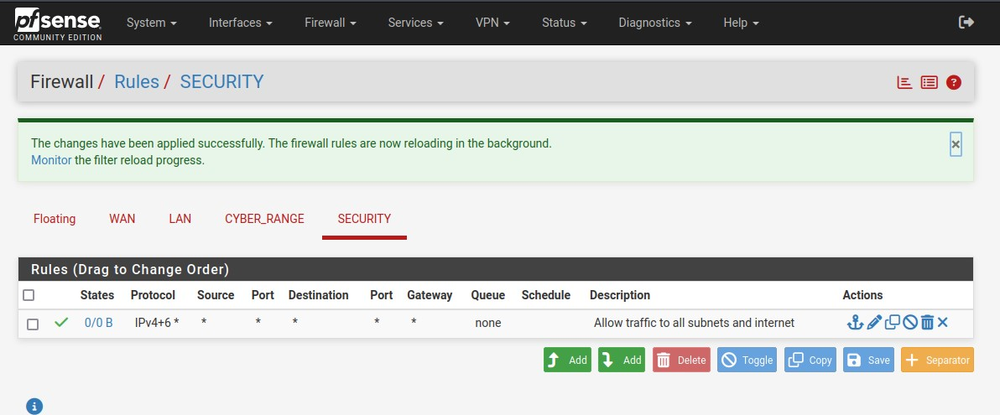

* **pfBlockerNG-devel Package Installation**  
  Successful deployment of the pfBlockerNG-devel package via pfSense Package Manager.
  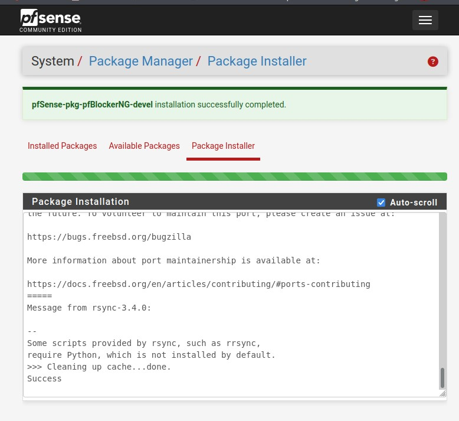

* **DNSBL Groups Overview**  
  pfBlockerNG DNSBL (DNS-based Blackhole List) management dashboard and ADs_Basic group configuration.
  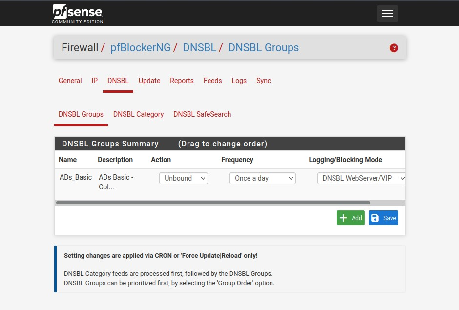

* **EasyList & EasyPrivacy Source Definitions**  
  Integration of external EasyList and EasyPrivacy feeds with Unbound DNS for automated ad/malicious domain blocking.
  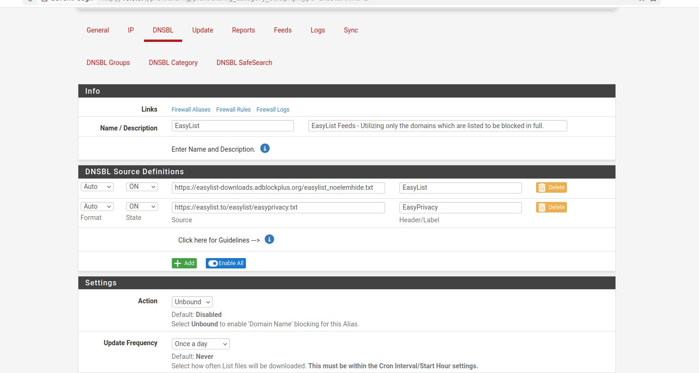

* **Custom Domain Blacklist**  
  Configuration of granular domain-level blocks using DNSBL Custom List definitions.
  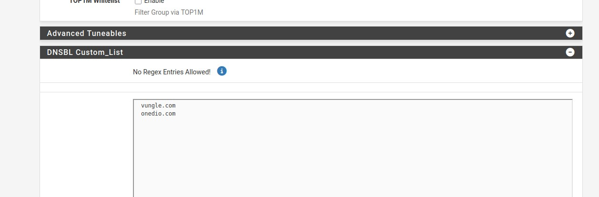

---

### 2. Test Environment & DNS Configuration

* **Metasploitable2 Target Virtual Machine**  
  Metasploitable2 vulnerable Linux virtual machine deployed as an attack and log analysis target.
  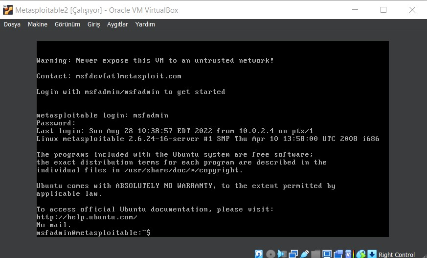
* **Ubuntu DNS Configuration (systemd-resolved)**  
  Managing and updating upstream DNS resolver settings on the Ubuntu host using `resolvectl`.
  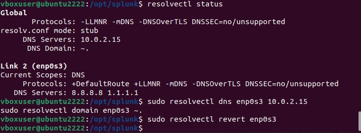

---

### 3. SIEM Deployment (Splunk)

* **Splunk Enterprise CLI Installation**  
  Debian package (`.deb`) installation and administrative provisioning of Splunk Enterprise via terminal.
  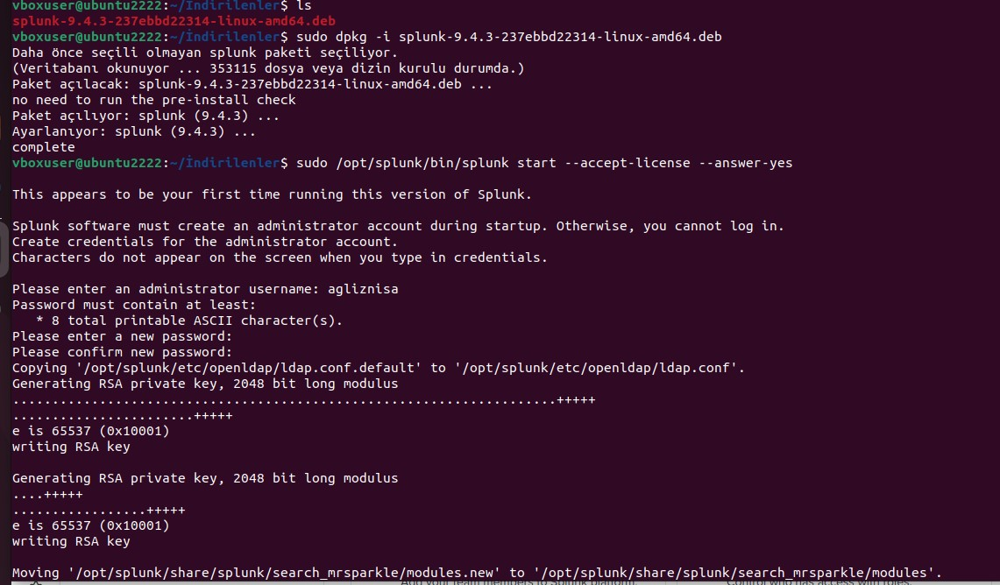

* **Splunk Web Management Console**  
  Splunk Enterprise management interface accessed via port 8000 after successful startup.
  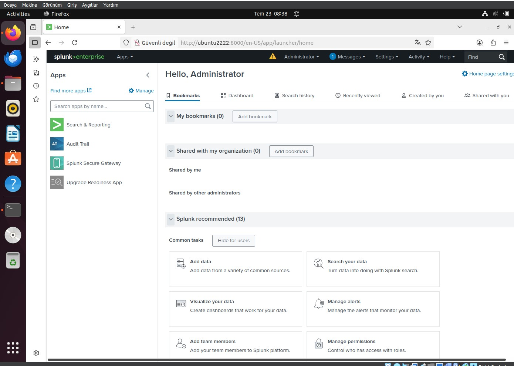

---

### 4. EDR / XDR Deployment & Security Monitoring (Wazuh)

* **Wazuh Dashboard Service Status**  
  Verification of the active `wazuh-dashboard.service` daemon status on the central server.
  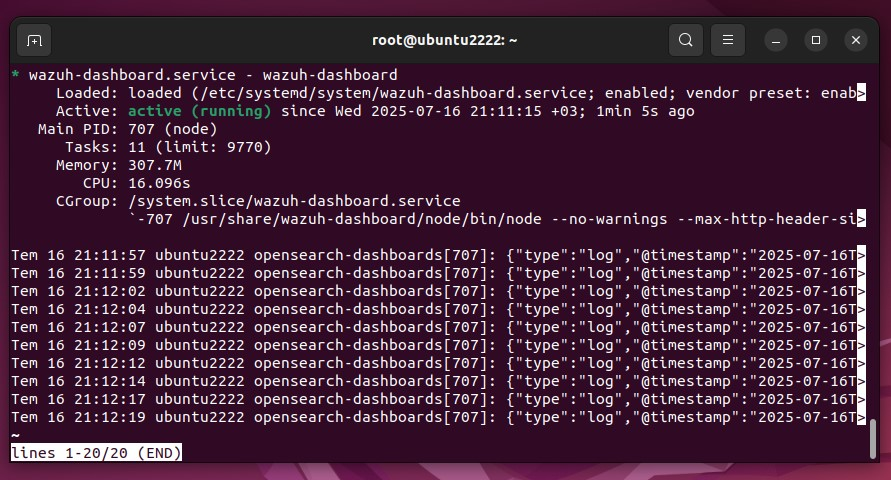

* **Wazuh Agent Service Status**  
  Wazuh endpoint agent (`wazuh-agent.service`) actively running and transmitting telemetry from the Kali Linux host.
  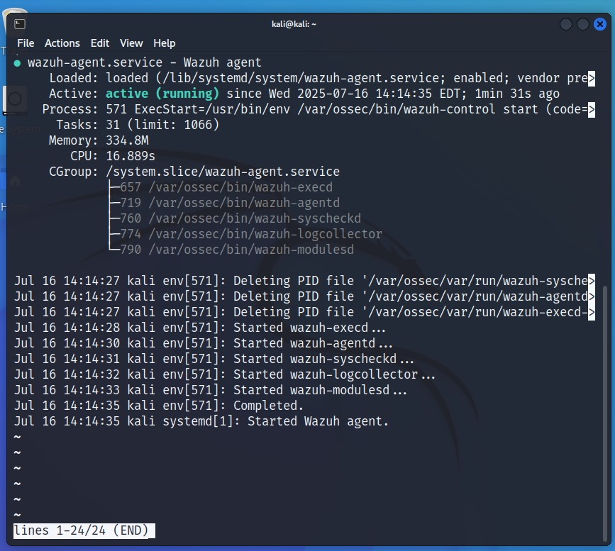

* **Wazuh Active Agents Overview**  
  Centralized dashboard displaying enrolled active agents, including the Kali Linux endpoint (`TarrAgent`).
  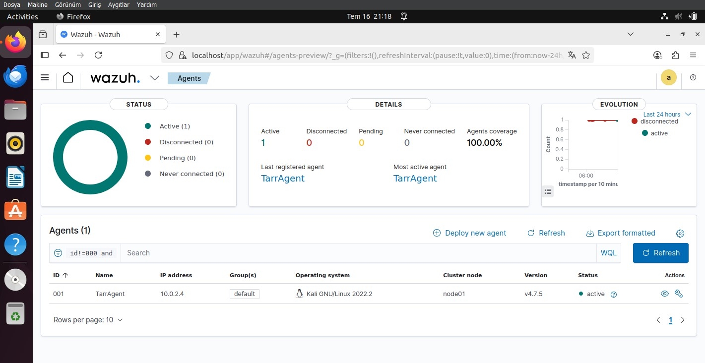

* **Agent Security & Compliance Metrics**  
  Detailed agent view outlining MITRE ATT&CK tactical alerts, SCA benchmarks, and PCI DSS compliance posture.
  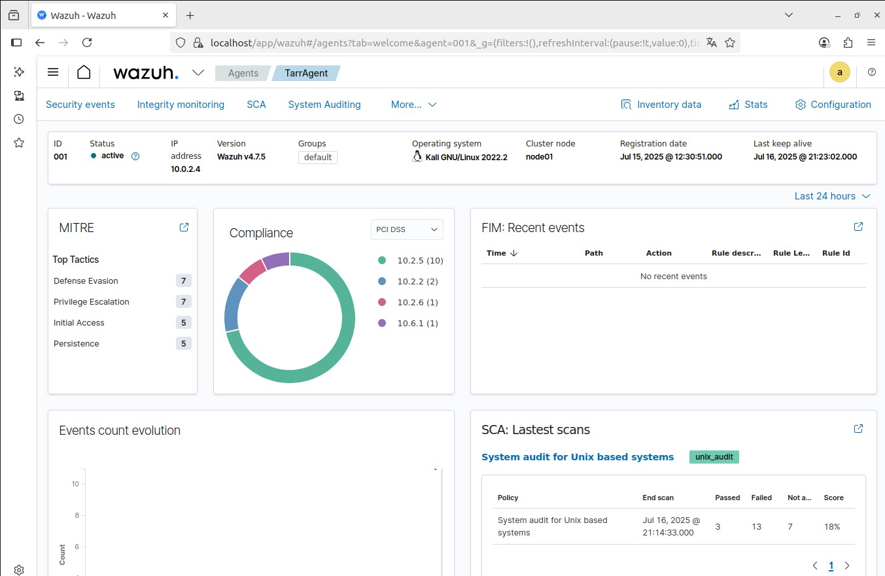

* **MITRE ATT&CK T1078 (Valid Accounts) Event Logs**  
  Ingested security events and PAM login session logs classified under MITRE technique T1078.
  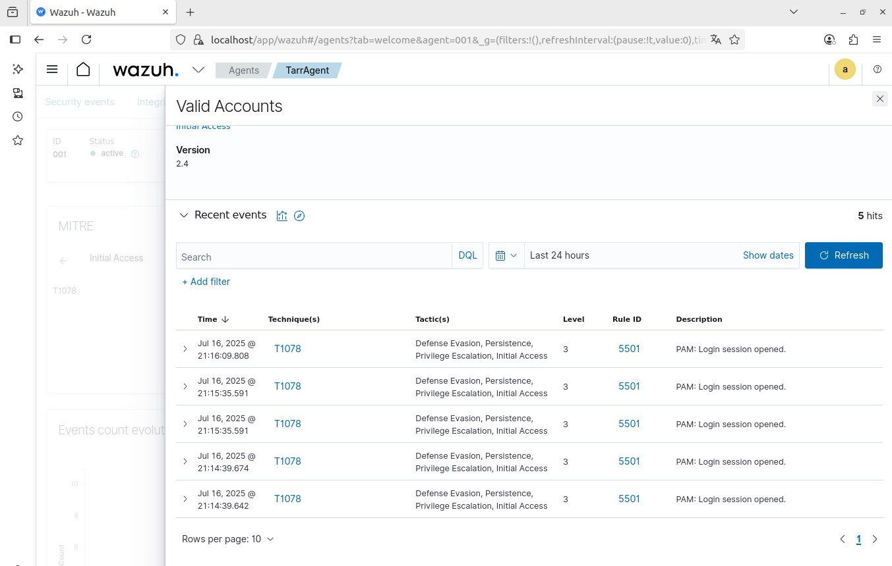

## 📚 References

- [pfSense Documentation](https://docs.netgate.com/pfsense/en/latest/)
- [Wazuh Documentation](https://documentation.wazuh.com/current/index.html)
- [Splunk Documentation](https://docs.splunk.com/Documentation)

